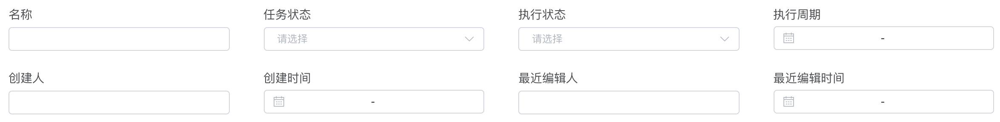

# compose-input for element-ui

template
```html
<el-form size="mini" label-position="top" label-width="100px" @submit.native.prevent>
  <compose-input 
          v-model="searchFormValue"
          :gutter="40"
          :define="searchFormDefine"
          :col-props="searchFromColProps"
  ></compose-input>

  <compose-input 
          v-model="searchFormValue"
          :gutter="40"
          :define="searchFormDefine"
          :col-props="searchFromColProps"
  ></compose-input>
</el-form>
```
script
```ts
  // 类型
  import {DefineItem, DefineItemFn} from 'compose-input';

  // 查询表单
  searchFormValue = [];
  searchFromColProps = { md: 6, sm: 8, xs: 24 };
  searchFormDefine: DefineItem[] = [
    { type: 'el-input', label: '名称', props: { clearable: true } },
    { type: 'el-select', label: '任务状态', options: mapToOptions(['1', '0']), props: { clearable: true } },
    { type: 'el-select', label: '执行状态', options: mapToOptions(['1', '0']), props: { clearable: true } },
    { type: 'el-date-picker', label: '执行周期', props: { type: 'daterange', format: 'yyyy-MM-dd' } },
    { type: 'el-input', label: '创建人', props: { clearable: true } },
    { type: 'el-date-picker', label: '创建时间', props: { type: 'daterange', format: 'yyyy-MM-dd' } },
    { type: 'el-input', label: '最近编辑人', props: { clearable: true } },
    { type: 'el-date-picker', label: '最近编辑时间', props: { type: 'daterange', format: 'yyyy-MM-dd' } },
  ];
```

最终效果



## 组件属性

```ts
    /** 
     * 组件结构定义 
     */
    define: DefineItem[];
    /** 
     * 级联 el-select 动态构建 el-options的数据源
     */
    dataSource?: {[key: string]: any;}[];

    /**
     * 列宽 el-col 的 span 属性, 如果没有指定将根据 define 的元素个数来计算
     */
    span?: number;

    /**
     * 栅格间距 el-row 的 gutter 属性 默认 16
     */
    gutter?: number;

    /**
     * 是否使用 el-form-item包装动态表单组件 默认为使用
     * 用法：no-form-item
     */
    noFormItem?: boolean;

    /**
     * 通用 el-form-item 属性
     */
    formItemProps?: {
        [key: string]: any;
    };

    /**
     * 通用 el-col 属性
     */
    colProps?: {
        [key: string]: any;
    };
```

## DefineItem 类型

```ts
  /**
   * 组件类型
   * 可选 'el-input' | 'el-select' | 'el-switch' | 'el-slider' | 'el-radio'| 'el-date-picker' | 'el-time-select' | 'el-checkbox'
  */
  type: string;

  /**
   * 动态组件属性 与 type 相匹配动态组件的属性，用于属性透传
   **/ 
  props: {[key: string]: any};

  /**
   * el-select  options 属性提升
   * type 为 el-select 时有效
   */
  options?: {
    label: string;
    value?: any;
    disabled?: true | false;
  }[];
  /**
   * 父级索引, define属性中定义的动态组件的索引序号，选项跟随父组件的值变化，当做级联选择时非常有用
   */
  parentIndex?: number;
  /**
   * 以下三项在动态构建 option 菜单时需要，需要在 compose-input 中指定 dataSource
   */
  optionsKeyName?: string;
  lableKeyName?: string;
  valueKeyName?: string;
  /**
   * el-form-item 属性透传 覆盖组件属性中定义的 通用 formItemProps
   */
  formItemProps?: OmitVueProp<FormItem>;
  /**
   * el-col 属性透传 覆盖组件属性中定义的 通用 colProps
   */
  colProps?: OmitVueProp<Col>;
  /**
   * el-form-item 的 label属性提升
   */
  label?: string;
```


## example typescript

```html
<template>
  <div>
    <h1>级联选择</h1>
    <compose-input 
        v-model="threeValue" 
        :define="threeDefine" 
        :data-source="threeDataSource"
    ></compose-input>
  </div>
</template>

<script lang="ts">
import { Component, Vue, Prop, Model } from 'vue-property-decorator';
import ComposeInput, { DefineItem, DefineItemFn } from 'compose-input';

const mapToOptions = (arr: string[]) => arr.map(it => ({ label: it, value: it }));
@Component({
  components: { ComposeInput },
})
export default class Demo extends Vue {
  // 级联
  threeValues = [];
  // compose-input 组件结构定义
  threeDefine: [DefineItem, DefineItem, DefineItem] = [
    { type: 'el-select', lableKeyName: 'strategyName', valueKeyName: 'id' },
    {
      type: 'el-select',
      // 级联配置
      parentIndex: 0,
      optionsKeyName: 'strategyOperation',
      lableKeyName: 'name',
      valueKeyName: 'id',
    },
    {
      type: 'el-select',
      // 级联配置
      parentIndex: 0,
      optionsKeyName: 'strategyValues',
      lableKeyName: 'name',
      valueKeyName: 'id',
    },
  ];
  // 数据从api获取 此处为 mock 数据
  threeDataSource = [
    {
      id: '1',
      strategyName: '网站名称',
      strategyOperation: [{ name: '等于', id: '=' }],
      strategyValues: [{ name: '百度', id: '1' }, { name: '新浪', id: '2' }, { name: '阿里', id: '3' }],
    },
    {
      id: '2',
      strategyName: '访问量',
      strategyOperation: [{ name: '大于', id: '>' }, { name: '等于', id: '=' }, { name: '小于', id: '<' }],
      strategyValues: [{ name: '10', id: '10' }, { name: '100', id: '100' }],
    },
  ];
}
</script>
```
